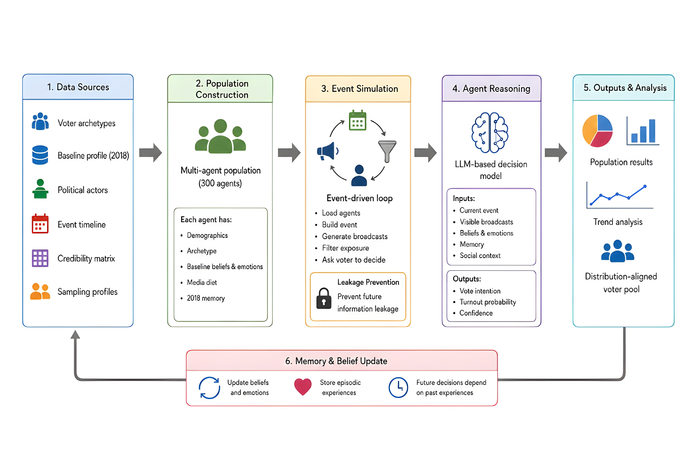

# Synthetic Turkey 🇹🇷

**A source-grounded, multi-agent LLM simulation that models how 300 synthetic voters update their beliefs and vote across the 2023 Turkish presidential election.**

<p align="left">
  
  
  
  
  <a href="LICENSE"></a>
</p>

> ⚠️ **What this is and isn't.** This is a *methodological* study of generative agent-based modeling — can LLM agents, grounded in real demographic and event data, reproduce plausible electorate dynamics? It is **not** an election prediction tool, and the entire voter population is **synthetic** (no human-subject data).

---

## 🧠 The idea in one picture

Each synthetic voter is an LLM-driven agent with demographics, a worldview, an emotional state, a media diet, and a memory. Time advances tick by tick: real campaign events are turned into political broadcasts, each agent is shown only the messages its media diet would expose it to, and then it decides who to vote for. Beliefs and emotions are updated and stored, so every future decision depends on the agent's own history.



---

## ❓ Why I built it

LLMs are increasingly used to "simulate" people for social-science research, but most demos are toy prompts with no grounding and no guards against leakage. I wanted to build a **realistic, reproducible pipeline** that takes the idea seriously as an engineering problem:

- **Grounding** — every agent is built from real 2018 baseline demographics and a curated 2018–2023 event timeline, not invented from thin air.
- **No hindsight cheating** — agents must never "know" the future. The engine enforces strict temporal **leakage prevention** so a voter on tick 5 cannot see events or outcomes from tick 30.
- **Reproducibility** — fixed population seed, pinned model/temperature/token budget, and saved canonical outputs so results can be inspected without spending a cent on API calls.
- **Evaluation** — the simulated vote distribution is scored against the real 2023 first-round and runoff results.

---

## ✨ Highlights

| Area | What it demonstrates |
|------|----------------------|
| 🤖 **Multi-agent LLM system** | 300 stateful agents, each with belief / affective / episodic memory that persists and feeds back into reasoning. |
| 🧩 **Prompt & context engineering** | Per-agent context assembly (current event, exposed broadcasts, beliefs, emotions, memory, social signals) → structured JSON decisions (vote intention, turnout probability, confidence). |
| 🔒 **Temporal leakage prevention** | An "election-safe" timeline expander guarantees agents only ever see information available at the current tick. |
| ⚡ **Production-minded engineering** | Concurrent agent execution within a tick, configurable workers, resume-from-log after interruption, and per-agent error isolation so one failed call can't sink a run. |
| 🧪 **Deterministic mock provider** | A mock LLM backend lets the whole pipeline run offline for tests and smoke checks — no API key, no cost. |
| 📊 **Evaluation pipeline** | Exports a panel dataset and aggregate tables, then scores the simulation against real 2023 results. |
| 🔁 **Reproducibility** | Seeded population, pinned model config, and committed baseline outputs. |

---

## 🏗️ Architecture

```
Data sources ─► Population ─► Event simulation ─► Agent reasoning ─► Outputs
 (archetypes,   (300 agent    (tick loop:          (LLM decision     (panel data,
  2018 profile,  JSON souls)   build event →        per agent →       aggregates,
  events,                      broadcasts →         vote + turnout    evaluation)
  credibility)                 filter exposure →    + confidence)
                               ask voter)                 │
                                     ▲                     │
                                     └──── memory & belief update ◄──┘
```

1. **Data sources** — voter archetypes, a 2018 baseline sampling profile, political actors, an event timeline, and a credibility matrix.
2. **Population construction** — 300 synthetic "souls", each a JSON agent with demographics, archetype, baseline beliefs/emotions, media diet, and a 2018 memory seed.
3. **Event simulation** — an event-driven tick loop builds the event, generates political broadcasts, filters exposure per agent's media diet, and asks each voter to decide.
4. **Agent reasoning** — an LLM-based decision model consumes the agent's full context and returns a structured vote intention, turnout probability, and confidence.
5. **Outputs & analysis** — population results, trend trajectories, and a distribution-aligned voter pool.
6. **Memory & belief update** — beliefs and emotions are updated and episodic experiences stored, so future decisions depend on past ones.

---

## 🛠️ Tech stack

- **Language:** Python 3.11
- **LLM:** OpenAI `gpt-4o-mini` (pluggable provider layer; deterministic mock backend included)
- **Data & analysis:** pandas, NumPy, matplotlib
- **Config:** YAML + JSON, validated on load
- **Concurrency:** thread-pool agent execution with resume + error isolation

---

## 📈 Reported baseline run

| Parameter | Value |
|-----------|-------|
| Provider / model | OpenAI `gpt-4o-mini` |
| Temperature | `0.45` |
| Token budget | `900` |
| Population seed | `20230528` |
| Agents | `300` |
| Processed ticks | `37` |
| Output panel | `11,100` rows × `38` columns |
| Primary artifact | `outputs/agent_trajectories.csv` |

> A single full run costs roughly **$8–10** and takes **8–10 hours**, so this repo ships the **saved canonical outputs** — you can inspect every result below without an API key. Live reruns may differ: LLM completions are stochastic and provider model snapshots change over time.

---

## 🚀 Quickstart

### 1. Install

```bash
python3 -m venv .venv
source .venv/bin/activate          # Windows: .venv\Scripts\activate
pip install -r requirements.txt
```

### 2. Inspect the saved results (no API key needed)

```bash
# Verify the panel shape: expect 38 columns and 11100 data rows
awk -F, 'NR==1 {print NF}' outputs/agent_trajectories.csv
awk -F, 'END {print NR-1}'  outputs/agent_trajectories.csv
```

Then explore the aggregate outputs directly:

- `outputs/aggregate_candidate_intention.csv`
- `outputs/aggregate_party_preference.csv`
- `outputs/first_round_vote_distribution.json`
- `outputs/runoff_vote_distribution.json`
- `outputs/evaluation_summary.json`
- `outputs/broadcasts.jsonl`, `outputs/reflections.jsonl`

### 3. Run the offline smoke test (deterministic mock LLM)

```bash
python3 run.py --mock --max-agents 5 --max-ticks 5 --output-dir outputs/reruns/mock_smoke
```

### 4. Run a full simulation (requires OpenAI key)

```bash
cp .env.example .env          # then add OPENAI_API_KEY=...

# Regenerate the 300-agent population if needed
python3 scripts/generate_souls_from_config.py --population-profile baseline_2018_300

# Run into separate directories so saved baseline artifacts stay intact
python3 run.py \
  --provider openai \
  --population-profile baseline_2018_300 \
  --parallel-agents --max-workers 5 \
  --continue-on-agent-error \
  --output-dir outputs/reruns/openai_baseline
```

A run can be resumed after an interruption with `--resume-from-log <run_log.jsonl>`.

---

## 📂 Project structure

```
voter_source_of_truth/     Voter archetypes + 2018 baseline sampling profile
political_broadcast_config/ Speakers, broadcast frames, credibility & persona config
events/                    Raw 2018–2023 event timeline
souls/                     300 generated synthetic voter-agent JSON files
agents/                    Citizen-agent and political-broadcast-agent logic
simulation/                Tick engine, leakage-safe timeline, parallelism, resume
llm/                       Mock + OpenAI provider adapters
memory/                    Affective, belief, and episodic memory stores
social/                    Peer / social-context signals
validation/                Output export + evaluation metrics
loaders/                   JSON/YAML config loading and validation
outputs/  logs/  db/       Saved baseline outputs, run logs, memory archives
scripts/                   Synthetic voter-soul generation utility
```

---

## 🔬 Engineering decisions worth calling out

- **Leakage prevention as a first-class feature.** The hardest correctness problem in event-based LLM simulation is hindsight bias. The timeline expander is built so an agent's context window can only contain information available at its current tick.
- **A pluggable provider layer.** Swapping the real OpenAI backend for a deterministic mock makes the pipeline testable and free to develop against — the same code path runs in CI-style smoke tests and in the full run.
- **Resilience over a 10-hour job.** Per-agent error isolation records a low-confidence fallback instead of crashing, and `--resume-from-log` continues a partial run, so a single bad API call doesn't waste hours of compute.
- **Reproducibility by construction.** A fixed population seed and pinned model config mean the population is regenerable and the run is documented end to end.

---

## 🔁 Reusing the pipeline for your own scenario

The pipeline is data-driven. To model a different population or election, edit the configs rather than the code:

1. Voter archetypes (numeric worldview, emotion, media, behavior vectors)
2. Baseline sampling profile (population counts → archetypes)
3. Event timeline (dated events)
4. Political broadcast config + credibility matrix
5. Candidate / party / runoff keys (must stay consistent across configs, prompts, validators, memory, and metrics)

See `REPRODUCIBILITY.md` for a short verification checklist.

---

## 📌 Limitations

- The population is fully synthetic and not a statistically validated sample of the real electorate.
- A single run cannot characterize run-to-run variance; repeated runs would be needed for that.
- This is a research prototype demonstrating a method, **not** a forecasting product.

---

## 📄 Citation

Abdullah Kılınç, *“Synthetic Turkey: A Source-Grounded Generative Agent-Based Simulation of the 2023 Turkish Presidential Election,”* Bachelor’s thesis, Marmara University, 2026.
